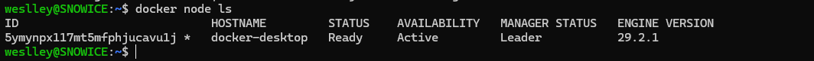

# ☎️ FreePBX-Swarm - Documentation

## Swarm setup

### Swarm way

Here are instructions to use this `docker-compose.yml` using swarm.
This way is valid for both local and remote hosts scenarios.

#### 1. First ensure the docker is running and swarm is enabled

```sh
docker node ls 
```

If the following output appears, its necessary init or join swarm:

`
Error response from daemon: This node is not a swarm manager. Use "docker swarm init" or "docker swarm join" to connect this node to swarm and try again.
`

Otherwise, a output like this will appear:



#### - 2. Then create the .env file

For that, use all variables from `docker-compose.yml` file;

#### - After that create network overlay attachable

```sh
docker network create --driver overlay --attachable pbxnet 
```

#### - Finally deploy the stack

```sh
docker stack deploy -d -c docker-compose.yml pbx 
```
